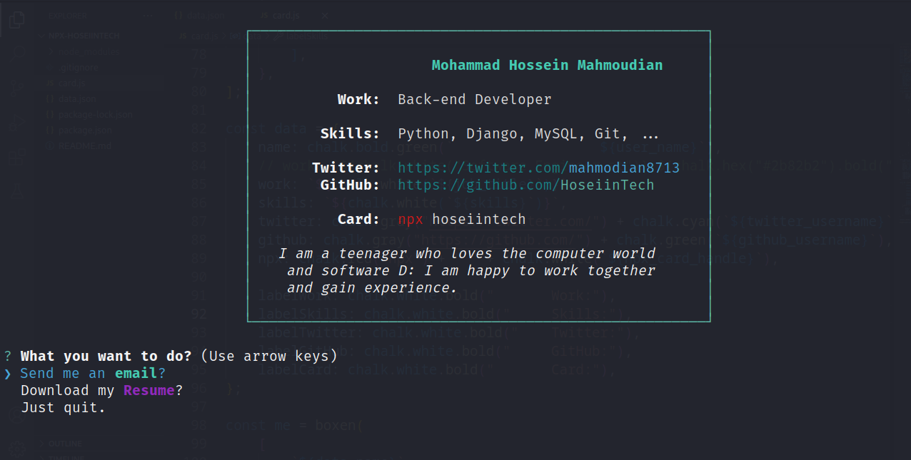

# Npx - Business Card
*****npx** is a digital business card :))***

## My Card 🔥


To show my card in your terminal:

```
npx hoseiintech
```

---

## Usage:

If you want to use this template, you can:

- Create account in **[npmjs](https://www.npmjs.com/)** .

- Login to your npm account in terminal ``` npm login ```

- Clone this repo in your system, and for install requirements ``` npm i ```

- Enter your information in **data.json** file :

```json
{
    "user_name": "Mohammad Hossein Mahmoudian",
    "user_email": "mahmodian8713@gmail.com",
    "job_title": "Back-end Developer",
    "skills": "Python, Django, MySQL, Git, ...",
    "npx_card_handle": "hoseiintech",
    "twitter_username": "mahmodian8713",
    "github_username": "HoseiinTech",
    "resume_url": "https://s28.picofile.com/d/8462149542/71c9016f-4930-483e-a3aa-bd2469e2ea48/Mahmoudian_Resume.pdf"
}
```

- Enter this information about yourself in **package.json** file:
    - **"name"** => your main npm name
    - **"version"** => 1.0.0
    - **"author"** => your full name
    - **"descriotion"** => a title for your npm
    - **"repository["url"]"** => your github npm repo link

```json
{
    "name": "hoseiintech",
    "version": "1.0.0",
    "author": "Mohammad Hossein Mahmoudian <mahmodian8713@gmail.com>",
    "description": "My Business Card (M. Mahmoudian)",
    "repository": {
        "type": "git",
        "url": "https://github.com/HoseiinTech/npx-hoseiintech"
}
```

- Commit changes: ``` git init ``` -> ``` git add . ``` -> ``` git commit -m "publish my card" ``` -> ``` git push ```

- To submit changes to npm: ``` npm publish ```

- Show in your terminal : ``` npx <npm name> ```

---

If you are good at JavaScript, you can change **card.js** file to change the theme :)

## Resource:

- [beyourahi github](https://github.com/beyourahi/npx_card)
- [bradgarropy github](https://github.com/bradgarropy/business-card)